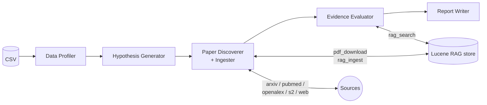

# SwarmAI Research Agent

A multi-agent research assistant built on the [SwarmAI](https://github.com/intelliswarm-ai/swarm-ai) framework. Given a CSV of observational data, it:

1. **Profiles** the dataset
2. **Generates** 3–5 testable research hypotheses
3. **Discovers** relevant papers across arXiv, Semantic Scholar, OpenAlex, PubMed, and the open web
4. **Downloads + ingests** them into a local Lucene-backed RAG store
5. **Evaluates** each hypothesis against the retrieved literature (SUPPORTS / CONTRADICTS / NEUTRAL with citations)
6. **Writes** a final markdown research report

## Architecture



Each box is a SwarmAI `Agent` running on Spring AI's `ChatClient`. The framework executes them sequentially with the previous task's output piped to the next.

## How it works

### The runtime model

Everything happens in one Spring Boot JVM:

1. **Spring Boot starts.** `ResearchAgentApplication` scans `ai.intelliswarm.swarmai.tool` and `ai.intelliswarm.swarmai.rag` (the tool packages — see [Configuration internals](#configuration-internals) for why the scan is narrowed).
2. **Tool beans register.** Each tool (`csv_analysis`, `arxiv_search`, `pubmed_search`, `pdf_download`, `rag_ingest`, `rag_search`, …) becomes a Spring bean. `BaseToolEventInterceptor` proxies every `BaseTool.execute(...)` call to emit `TOOL_STARTED/COMPLETED/FAILED` events.
3. **Lucene + embeddings come up.** `SwarmaiRagAutoConfiguration` waits for OpenAI's `EmbeddingModel` bean to register, then opens a `LuceneVectorStore` on disk at `.research-agent-index/`. First-time it's empty; on rerun it picks up where it left off.
4. **`ResearchAgentWorkflow.run(csvPath)` fires.** Five `Agent` instances are built in code (role / goal / backstory / tools / `maxTurns` / `permissionMode` / `temperature` / `maxExecutionTime`), five `Task`s are wired with `dependsOn(...)` edges, and a `Swarm` with `ProcessType.SEQUENTIAL` is kicked off.
5. **SwarmAI executes tasks in order.** Each task's prompt is the previous task's output plus the agent's goal. Agents in `reactive` mode loop over `[LLM call → tool calls → continue]` until the LLM returns a final answer or `maxTurns` is hit.
6. **The Reporter's response is the report.** Its goal explicitly says "your entire response must BE the report" so its single LLM completion is written to `output/research_report.md` (via `Task.outputFile(...)`).

### Per-stage detail

#### Stage 1 — Senior Data Analyst (Profiler)
- **Tools:** `file_read`, `csv_analysis`
- **Permission:** `READ_ONLY`, `maxTurns: 3`, `temperature: 0.1`
- **What it does:** reads the first 5 rows of the CSV with `file_read`, then calls `csv_analysis` with `operation='describe'` and `operation='stats'` to get column types, null counts, distributions. Produces a data dictionary + sample rows + a 3–5 sentence domain summary.
- **Output:** ~4 KB markdown.

#### Stage 2 — Research Hypothesizer
- **Tools:** none (pure LLM reasoning)
- **Permission:** `READ_ONLY`, `maxTurns: 1`, `temperature: 0.3`
- **What it does:** reads the profile, emits 3–5 testable hypotheses. Each is tagged with: columns it depends on, study design that would test it, recommended literature source (`arxiv` / `pubmed` / `openalex` / `semantic_scholar` / `web`).
- **Output:** numbered markdown list. The discipline tag steers Stage 3.

#### Stage 3 — Literature Discovery & Ingestion Specialist
- **Tools:** `arxiv_search`, `semantic_scholar_search`, `openalex_search`, `pubmed_search`, `web_search`, `pdf_download`, `rag_ingest`
- **Permission:** `WORKSPACE_WRITE`, `maxTurns: 20`, `temperature: 0.2`
- **What it does, per hypothesis:**
  1. Picks the right paper-source tool based on the hypothesis's discipline tag.
  2. Reads the search results; for each promising paper extracts the PDF URL (arXiv gives a direct PDF link; Semantic Scholar exposes `openAccessPdf.url`; OpenAlex exposes `open_access.oa_url`).
  3. Calls `pdf_download` with **only** the `url` — the saved path lands under `./papers/`.
  4. Calls `rag_ingest` with `path=<saved_path>` and `source=<id>:<short-title>`. The source label is propagated to every chunk as metadata for later citation.
- **Capped at 8 ingestions total** to keep wall-clock + token cost bounded.
- The agent is told never to fabricate paper IDs or URLs.

#### Stage 4 — Evidence Evaluator
- **Tools:** `rag_search`
- **Permission:** `READ_ONLY`, `maxTurns: 15`, `temperature: 0.1`
- **What it does, per hypothesis:** runs 2–3 paraphrased `rag_search` queries. For every returned chunk it classifies `SUPPORTS` / `CONTRADICTS` / `NEUTRAL` and cites the chunk's `source` label. Ends with one verdict per hypothesis: `SUPPORTED` / `CONTRADICTED` / `INCONCLUSIVE`.
- The agent is told that if passages don't address the hypothesis directly, return `INCONCLUSIVE` rather than overreaching.

#### Stage 5 — Research Report Writer
- **Tools:** none
- **Permission:** `READ_ONLY`, `maxTurns: 1`, `temperature: 0.2`
- **What it does:** receives the full evidence trail and writes the final markdown report with five sections: Dataset summary → Hypotheses → Literature ingested → Findings (verdict + 2–4 cited quotes per hypothesis) → Limitations.

### What each new RAG tool does

| Tool | Inputs | Output | Mechanism |
|---|---|---|---|
| `pdf_download` | `url` | Saved path | `HttpClient` GET → writes to `./papers/<filename>` (max 100 MB). `dir` parameter is ignored to prevent the agent from hallucinating paths like `/app`. |
| `rag_ingest` | `path`, `source`, `chunk_size`, `chunk_overlap`, `metadata` | "N chunks indexed" | Sniffs the first 5 bytes — if `%PDF-` uses PDFBox, otherwise treats as text and strips HTML tags. Then `TokenTextSplitter` chunks → `EmbeddingModel.embed()` → `VectorStore.add()`. Each chunk carries the `source` label. |
| `rag_search` | `query`, `top_k`, `threshold`, `source_prefix` | Top-K chunks with citation | `EmbeddingModel.embed(query)` → Lucene `KnnFloatVectorQuery` → ranked results, each prefixed with its source label. |
| `semantic_scholar_search` | `query`, `limit` | Title/authors/abstract/openAccessPdf | Single GET to `api.semanticscholar.org/graph/v1/paper/search`. No key. |
| `openalex_search` | `query`, `limit` | Title/authors/DOI/oa_url + reconstructed abstract | Single GET to `api.openalex.org/works`. Honors `OPENALEX_MAILTO` for polite-pool routing. |
| `pubmed_search` | `query`, `limit` | Title/authors/journal/PMID/DOI | Two GETs: `esearch.fcgi` (PMIDs) → `esummary.fcgi` (metadata). Honors `NCBI_API_KEY` to lift the rate limit. |

### Important behaviors the run revealed

- **PubMed URLs aren't PDFs.** A `pubmed.ncbi.nlm.nih.gov/<PMID>` URL returns the HTML landing page, not the article PDF. `RagIngestTool` handles this transparently: it detects HTML by magic bytes, strips `<script>`/`<style>`/tags, and ingests the remaining text. For real PDFs, use OpenAlex's `oa_url` or arXiv's direct PDF link.
- **Lucene 9 caps vectors at 1024 dims.** OpenAI's `text-embedding-3-small` defaults to 1536. `application.yml` requests `dimensions: 1024` to stay under the limit. If you swap to a different embedding model, check its native dimension.
- **Tool resolution requires `isDynamic() = true`.** SwarmAI's older path expects each tool to also be registered as a Spring AI `@Bean Function<Request, String>` (see swarmai-tools' `ToolsConfiguration`). New tools that skip that registration must override `BaseTool.isDynamic()` so the framework wraps them as `FunctionToolCallback` at agent build time. All six `swarmai-rag` tools do this.

## Configuration internals

`swarmai-core` ships transitive support for many providers (Anthropic + Ollama + OpenAI chat models, Chroma + PgVector vector stores, JPA / Redis / Hibernate for persistent memory). This Spring Boot app wants only OpenAI + Lucene + no DB, so `application.yml` excludes the rest:

```yaml
spring:
  autoconfigure:
    exclude:
      # Other chat providers
      - org.springframework.ai.model.anthropic.autoconfigure.AnthropicChatAutoConfiguration
      - org.springframework.ai.model.ollama.autoconfigure.OllamaChatAutoConfiguration
      - org.springframework.ai.model.ollama.autoconfigure.OllamaEmbeddingAutoConfiguration
      # OpenAI extras we don't need
      - org.springframework.ai.model.openai.autoconfigure.OpenAiAudioSpeechAutoConfiguration
      - org.springframework.ai.model.openai.autoconfigure.OpenAiAudioTranscriptionAutoConfiguration
      - org.springframework.ai.model.openai.autoconfigure.OpenAiImageAutoConfiguration
      - org.springframework.ai.model.openai.autoconfigure.OpenAiModerationAutoConfiguration
      # Vector stores we don't want (Lucene from swarmai-rag wins)
      - org.springframework.ai.vectorstore.chroma.autoconfigure.ChromaVectorStoreAutoConfiguration
      - org.springframework.ai.vectorstore.pgvector.autoconfigure.PgVectorStoreAutoConfiguration
      # JDBC / JPA / Redis — only needed for swarmai-core's persistent memory features
      - org.springframework.boot.autoconfigure.jdbc.DataSourceAutoConfiguration
      - org.springframework.boot.autoconfigure.orm.jpa.HibernateJpaAutoConfiguration
      - org.springframework.boot.autoconfigure.jdbc.DataSourceTransactionManagerAutoConfiguration
      - org.springframework.boot.autoconfigure.data.jpa.JpaRepositoriesAutoConfiguration
      - org.springframework.boot.autoconfigure.data.redis.RedisAutoConfiguration
      - org.springframework.boot.autoconfigure.data.redis.RedisRepositoriesAutoConfiguration
```

`ai.intelliswarm.swarmai.memory.MemoryAutoConfiguration` is a regular `@Configuration` (not in `AutoConfiguration.imports`) that hard-references Redis classes. We sidestep it by **narrowing the component scan**:

```java
@SpringBootApplication(scanBasePackages = {
    "ai.intelliswarm.researchagent",
    "ai.intelliswarm.swarmai.tool",  // tools we want
    "ai.intelliswarm.swarmai.rag"    // our new RAG module
    // deliberately NOT ai.intelliswarm.swarmai.memory / .knowledge — those need Redis/JDBC
})
```

## Prerequisites

- **Java 21+** and **Maven**
- **OpenAI API key** (`OPENAI_API_KEY`) — used for the chat model and embeddings. Swap to another Spring AI provider by changing the dependency in `pom.xml` and the `spring.ai.*` block in `application.yml`.
- The locally-built **`swarmai-rag` module** (`mvn install` from `D:\Intelliswarm.ai\swarm-ai\` once).

### Optional env vars

| Variable | Purpose |
|---|---|
| `RESEARCH_AGENT_CHAT_MODEL` | Override chat model (default `gpt-4.1-mini`) |
| `RESEARCH_AGENT_EMBED_MODEL` | Override embedding model (default `text-embedding-3-small`) |
| `OPENALEX_MAILTO` | Your email — opts into OpenAlex's higher-priority "polite pool" |
| `NCBI_API_KEY` | Lifts PubMed rate limit from 3 req/s to 10 req/s |

## Quick start

```bash
cd D:\Intelliswarm.ai\swarm-ai
mvn -DskipTests install              # builds + installs swarmai-rag locally

cd D:\Intelliswarm.ai\research-agent
export OPENAI_API_KEY=sk-...

./run.sh                             # uses data/sample.csv
./run.sh path/to/your.csv            # uses your own CSV
```

The final report is written to `output/research_report.md`. Downloaded PDFs land in `papers/`. The vector index lives in `.research-agent-index/`.

## Bundled datasets

| File | Description |
|---|---|
| `data/sample.csv` | Synthetic 25-patient cardiovascular cohort (BMI, smoking, exercise, BP, HbA1c, LDL, statin vs placebo, follow-up, outcome). Provokes biomedical hypotheses. |
| `data/heart-failure.csv` | **Real** UCI Heart Failure Clinical Records (Ahmad et al., 2017) — 299 patients, 13 vars (age, ejection_fraction, serum_creatinine, anaemia, diabetes, smoking, …, DEATH_EVENT). Used for the sample-run output below. |

Replace either with any CSV. The Profiler infers the domain and the Hypothesizer steers the literature search accordingly.

## Sample run (Heart Failure dataset)

`./run.sh data/heart-failure.csv` against `gpt-4.1-mini` + `text-embedding-3-small` (1024d):

| Stage | Duration | Notable activity |
|---|---|---|
| 1. Profiler | 17 s | `file_read` + `csv_analysis describe/stats` → 13-col data dictionary |
| 2. Hypothesizer | 13 s | 5 biomedical hypotheses, all tagged `pubmed` |
| 3. Discoverer | 218 s | `pubmed_search` × N → `pdf_download` × 5 → `rag_ingest` × 3 successful (11 chunks indexed) |
| 4. Evaluator | 74 s | `rag_search` × 12 queries, top-k=5 hits each |
| 5. Reporter | 24 s | 7.1 KB markdown report with verbatim PubMed quotes |
| **Total** | **346 s** | **~$0.15–0.30 in OpenAI tokens** |

Final verdicts (excerpt from `output/research_report.md`):

| Hypothesis | Verdict | Cited source |
|---|---|---|
| Eryptosis plays a significant role in metabolic and cardiovascular diseases | **SUPPORTED** | pubmed:42155670 |
| Finerenone is cost-effective in HFmrEF / HFpEF | **SUPPORTED** | pubmed:42178507 (FINEARTS-HF) |
| Ibadan project reports baseline + 6-month outcomes | **SUPPORTED** | pubmed:42177830 |
| Smoking associated with mortality in heart failure | **INCONCLUSIVE** | — no relevant lit ingested |
| Platelet count and survival in liver disease | **INCONCLUSIVE** | — out-of-scope vs ingested papers |

Every `SUPPORTED` verdict carries 2–4 verbatim quotes from the indexed PubMed paper, each tagged with its `source` label. The `INCONCLUSIVE` verdicts are conservative — the agent did not strain interpretation when retrieved passages didn't address the claim directly.

## How the pipeline plays it safe

- **No fabricated citations.** The discovery agent is instructed never to make up paper IDs or URLs — every PDF it ingests comes from a tool response.
- **Ingestion is capped at 8 papers** by default to keep the run bounded.
- **Workspace-write permission** is required for downloading and ingesting; the evaluator and reporter run read-only.
- **Citations are first-class.** Every chunk written to the vector store carries its `source` label (e.g. `arxiv:2401.12345:transformer-interpretability`). The Evaluator quotes that label on every verdict.
- **Verdicts are conservative.** If retrieved passages don't address a hypothesis directly, the Evaluator returns `INCONCLUSIVE` rather than overreaching.

## Module layout

```
research-agent/
├── pom.xml
├── run.sh
├── data/sample.csv
├── papers/                              ← downloaded PDFs land here
├── output/                              ← final report lands here
└── src/main/
    ├── java/ai/intelliswarm/researchagent/
    │   ├── ResearchAgentApplication.java
    │   └── ResearchAgentWorkflow.java   ← the 5-stage SEQUENTIAL workflow
    └── resources/application.yml
```

## Extending the agent

- **Add a new paper source.** Implement `BaseTool` (see `SemanticScholarTool` for a template) and register it as a Spring bean. The discoverer will pick it up via the SwarmAI tool registry once you add it to the `Agent.builder().tool(...)` list in the workflow.
- **Swap the vector store.** Define your own `VectorStore` bean (Chroma, PGVector, Pinecone) in any `@Configuration` class. The `LuceneVectorStore` auto-config will step aside.
- **Tweak chunking.** Pass `chunk_size` / `chunk_overlap` in `rag_ingest`'s parameter map, or change the defaults in `RagIngestTool`.
- **Add HyDE / reranking.** Compose a `VectorStore` wrapper that pre-rewrites the query (HyDE) or post-reorders results. The agent code does not change.

