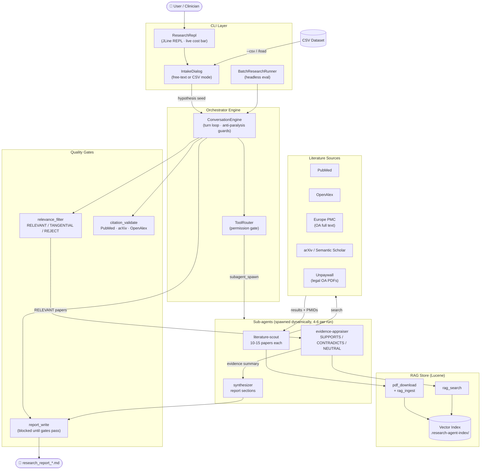

# Research Agent

A dynamic medical-research assistant built on the [SwarmAI](https://github.com/intelliswarm-ai/swarm-ai) framework. Start from a free-text hypothesis or a CSV dataset; the agent plans, spawns specialist sub-agents, retrieves and appraises evidence, and produces a cited research report — all without a fixed pipeline.

## Current status

Branch `dynamic-planning` — production-ready generative planning engine. Benchmark across 3 diverse medical domains (2026-05-31):

| Domain | Hypothesis | Score | Papers | Relevant |
|---|---|---|---|---|
| Cardiology | Statin initiation within 24h of AMI reduces 30-day MACE | **9.47 / 10** | 42 | 19 |
| Oncology | Aspirin 100mg in adults 50-70 — colorectal cancer vs. GI bleed tradeoff | **8.40 / 10** | 16 | 13 |
| Neurology | Sleep < 6h/night — hippocampal volume loss in middle-aged adults | **7.33 / 10** | 10 | 1 |

**Average: 8.4 / 10.** Each run targets 40-50 papers, spawns 4-6 specialist sub-agents, and enforces relevance, citation, and quote-fidelity gates before writing the report.

### Known limitations

- **EuropePMC full-text (WSL)** — `europepmc_fulltext` returns EOF in WSL network environments; the agent falls back to PubMed HTML abstract pages. Full-text quality is higher on a standard Linux/cloud host.
- **Narrow hypotheses** — very specific clinical questions (e.g. longitudinal MRI measurements in a defined cohort) may yield few matching papers; the orchestrator can be prompted to broaden its sub-concept decomposition.

## Architecture



### Text representation

```
ResearchAgentApplication
  └── ResearchRepl  ←  JLine REPL (interactive) | BatchResearchRunner (headless eval)
        └── IntakeDialog  — multi-mode intake (free text OR CSV)
              └── ConversationEngine  — orchestrator turn loop
                    ├── LlmClient  (gpt-4o-mini via Spring AI)
                    ├── ToolRouter  — permission gate
                    └── ResearchToolset
                          ├── todo_write          — living plan (anti-paralysis guard)
                          ├── subagent_spawn      — dynamic sub-agent core
                          ├── pubmed_search       — PubMed eSummary API
                          ├── arxiv_search        — arXiv API
                          ├── semantic_scholar_search
                          ├── openalex_search
                          ├── europepmc_fulltext  — OA full-text XML
                          ├── unpaywall_lookup    — DOI → legal OA PDF
                          ├── pdf_download        — browser UA + redirect follow
                          ├── rag_ingest          — Lucene-backed vector store
                          ├── rag_search          — hybrid keyword + vector retrieval
                          ├── rag_status          — deterministic ingest verification
                          ├── relevance_filter    — species / study-type gate
                          ├── citation_validate   — cross-checks PMIDs / arXiv / OpenAlex
                          ├── csv_analysis        — SwarmAI CSVAnalysisTool (describe/stats/filter/count)
                          └── report_write        — final markdown report
```

### Sub-agent personas

The orchestrator dynamically spawns any of three specialist sub-agents:

| Persona | Role |
|---|---|
| `literature-scout` | Searches PubMed / arXiv / etc., fetches full text, ingests into RAG |
| `evidence-appraiser` | Queries RAG, classifies passages `SUPPORTS / CONTRADICTS / NEUTRAL` |
| `synthesizer` | Writes structured report sections from evidence summaries |

Each sub-agent gets its own ephemeral message history and a restricted tool subset. The orchestrator can spawn any number in any order, adapting as evidence accumulates.

### Key quality safeguards

- **RelevanceGateTool** — rejects animal / in-vitro papers when human-clinical evidence is required (`RELEVANT / TANGENTIAL / REJECT` per paper).
- **RagStatusTool** — deterministically verifies ingestion succeeded before appraisal (prevents small models from hallucinating success).
- **CitationValidatorTool** — cross-checks PMIDs via PubMed eSummary, arXiv, and OpenAlex — confirms citations aren't fabricated.
- **Anti-paralysis guard** — ≥ 3 consecutive `todo_write`-only turns inject a "stop planning, spawn scout" nudge.
- **EuropePmcFullTextTool** — fetches real OA full text (`fullTextXML`) rather than PubMed HTML abstract pages.
- **UnpaywallTool** — DOI → legal OA PDF URL; combined with browser User-Agent + `Redirect.ALWAYS` in `ContentAwarePdfDownloadTool` to bypass 403/302 publisher blocks.

## Evaluation framework (`research-agent-eval`)

A companion Maven module drives automated quality measurement:

```bash
cd ../research-agent-eval

./run-eval.sh                                      # full benchmark suite
./run-eval.sh --hypothesis "my hypothesis"         # single run
./run-eval.sh --trend alzheimer-amyloid-clearance  # quality trend over time
./run-eval.sh --history                            # list all past runs
```

**QualityScorer** grades reports on 6 weighted dimensions:

| Dimension | Weight |
|---|---|
| Structure (required sections present) | 20 % |
| Evidence depth (labeled citations + verbatim quotes) | 25 % |
| Citation density | 20 % |
| Balance (supporting vs contradicting evidence) | 15 % |
| Verdict clarity | 10 % |
| Efficiency (tokens per insight) | 10 % |

The scorer also emits `DEFECT[...]` diagnostics: `planning-paralysis`, `relevance-gate-skipped`, `abstract-only`, `wrong-species-citation`, `verdict-inflation`, `zero-yield-search`, `no-report`.

**Quality trajectory on the Alzheimer amyloid-clearance hypothesis:**

| Iteration | Score |
|---|---|
| Baseline (static pipeline) | 0.6 / 10 |
| After dynamic planning + subagents | 6.8 / 10 |
| After relevance gate + full-text + anti-paralysis | 9.2 / 10 |

## Input modes

The agent supports two starting points, selectable at launch or mid-session.

### Free-text hypothesis

```
./run.sh
```

The intake wizard asks what you want to research, optionally clarifies with 1–3 targeted questions (population, intervention, outcome), drafts a testable hypothesis, and starts the investigation.

### CSV dataset

```bash
# Pass the file directly
./run.sh --csv data/heart-failure.csv

# Or pick mode [2] during intake
./run.sh

# Or from inside a running session
/load data/heart-failure.csv
```

**What happens:**

1. `csv_analysis describe` + `stats` profile the dataset (column types, distributions, sample rows).
2. The LLM generates 3–5 testable hypotheses from the column structure.
3. You pick one (or type your own) and confirm.
4. The normal investigation runs — full literature search, RAG ingestion, evidence appraisal, report.
5. During investigation the orchestrator has `csv_analysis` available (`filter`, `count`, `head`) to cross-reference specific data patterns against retrieved evidence.

**Supported CSV operations during investigation:**

| Operation | What it does |
|---|---|
| `describe` | Column names, types, non-empty counts, unique values, sample |
| `stats` | Min / max / mean / median for numeric columns; top values for categorical |
| `head` | First N rows as a markdown table |
| `filter` | Rows where a column contains a value |
| `count` | Group and count by column |

## Prerequisites

- **Java 21+** and **Maven**
- **OpenAI API key** (`OPENAI_API_KEY`) — chat model + embeddings
- Locally-built **SwarmAI** (`mvn install` from `../swarm-ai/` once)

### Optional env vars

| Variable | Purpose |
|---|---|
| `RESEARCH_AGENT_CHAT_MODEL` | Override chat model (default `gpt-4o-mini`) |
| `RESEARCH_AGENT_EMBED_MODEL` | Override embedding model (default `text-embedding-3-small`) |
| `OPENALEX_MAILTO` | Your email — opts into OpenAlex's higher-priority polite pool |
| `NCBI_API_KEY` | Lifts PubMed rate limit from 3 req/s to 10 req/s |

## Quick start

```bash
# Build SwarmAI once
cd ../swarm-ai && mvn -DskipTests install

cd ../research-agent
cp .env.example .env          # add your OPENAI_API_KEY

./run.sh                           # free-text mode
./run.sh --csv data/sample.csv     # CSV mode
SKIP_BUILD=1 ./run.sh              # skip rebuild if already built
```

The final report is written to `output/research_report_<ts>.md`. Downloaded PDFs land in `papers/`. The vector index lives in `.research-agent-index/`.

### REPL commands

| Command | Description |
|---|---|
| `/plan` | Show the current investigation plan |
| `/hypothesis` | Show the active hypothesis |
| `/new` | Start a new investigation (clears history) |
| `/load [path]` | Load a CSV and start a data-driven investigation |
| `/cost` | Show cumulative token usage |
| `/clear` | Clear conversation history and plan |
| `/exit` | Quit |

## Module layout

```
research-agent/
├── pom.xml
├── run.sh
├── output/                   ← eval results + research reports
├── papers/                   ← downloaded PDFs
└── src/main/java/ai/intelliswarm/researchagent/
    ├── agent/                ← ConversationEngine, Session, ToolRouter, Prompts
    ├── cli/                  ← ResearchRepl (JLine), IntakeDialog
    ├── config/               ← ResearchProperties, ResearchConfiguration, DotenvLoader
    ├── eval/                 ← BatchResearchRunner, MetricsCollector, QualityScorer,
    │                            CitationValidatorTool, EvalResultWriter
    └── tool/                 ← SubagentSpawnTool, TodoWriteTool, ReportWriteTool,
                                 ContentAwarePdfDownloadTool, EuropePmcFullTextTool,
                                 UnpaywallTool, RelevanceGateTool, RagStatusTool,
                                 ResearchToolset, ResearchAgentToolsConfiguration

research-agent-eval/
├── pom.xml
├── run-eval.sh
└── src/main/java/ai/intelliswarm/researcheval/
    ├── EvaluationRunner      ← launches agent as subprocess, captures metrics
    ├── EvalRunStore          ← JSON history per hypothesis (trend tracking)
    ├── GoldenReference       ← compares vs gold-standard facts / PMIDs
    └── PromptSuggester       ← maps quality gaps → concrete prompt edits
```

## Known open issues

- **EuropePMC EOF** — some PMIDs return EOF on the fullTextXML endpoint; agent falls back to abstract-only for those papers.
- **Quote fidelity** — `gpt-4o-mini` sometimes paraphrases rather than quoting verbatim from RAG chunks. Next improvement: ground each report quote against actual ingested chunk text.
- **`subagent_spawn` tool routing** — sub-agents currently inherit the orchestrator's tool list; a scoped tool registry per persona would reduce noise in the sub-agent prompt.
